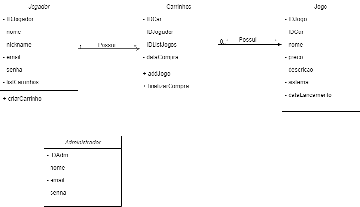
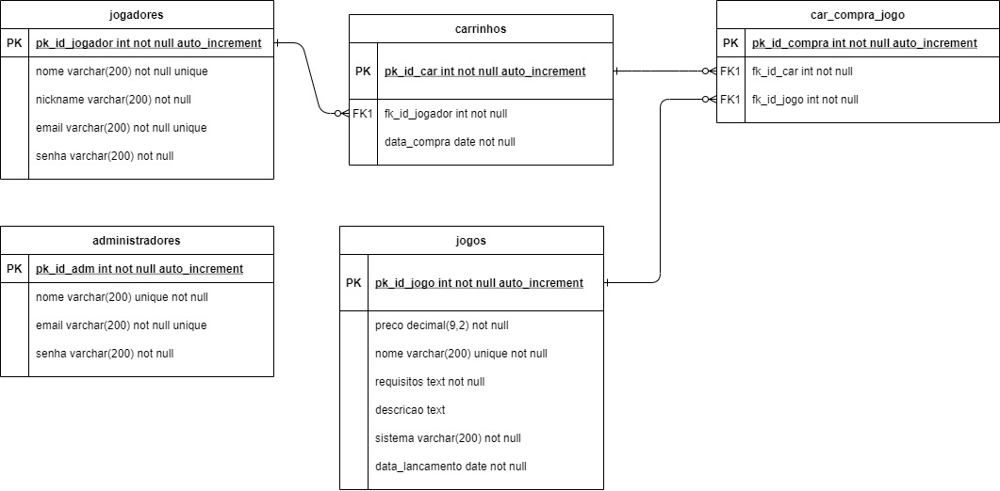

# Projeto Final do Curso de Ensino Médio Técnico Integrado de Desenvolvimento de Sistemas - Colégio Pedro II - Campus Duque de Caxias - 2021

## Nome do Projeto: | 𝜓 〉GAMES - Psi Games

## Descrição do Projeto

 Psi Games é uma empresa <s>fictícia</s> virtual de desenvolvimento e venda de jogos eletrônicos. Esse projeto trata-se de uma plataforma Web em site onde jogadores podem criar uma conta e adquirir jogos. 

## Documentação

- [Manual do Usuário](documentacao/manual/manual.md)
- [Requisitos](requisitos.md)
- [Casos de Uso](casos-de-uso.md)
- [Apresentação](apresentacao.pdf)

**Diagrama de Classes**

**Modelagem do Banco de Dados**

