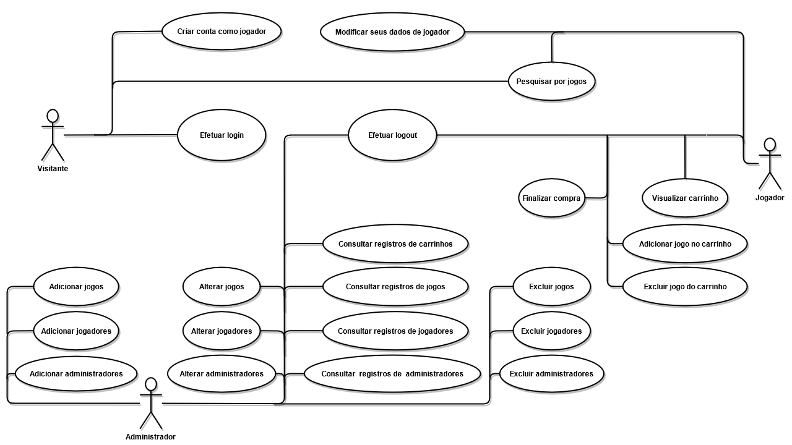
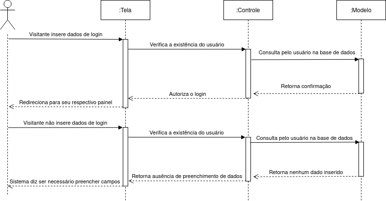
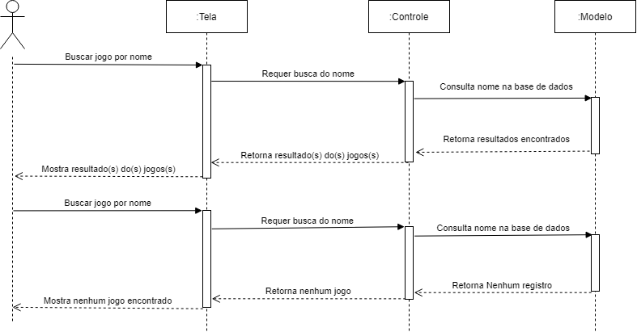
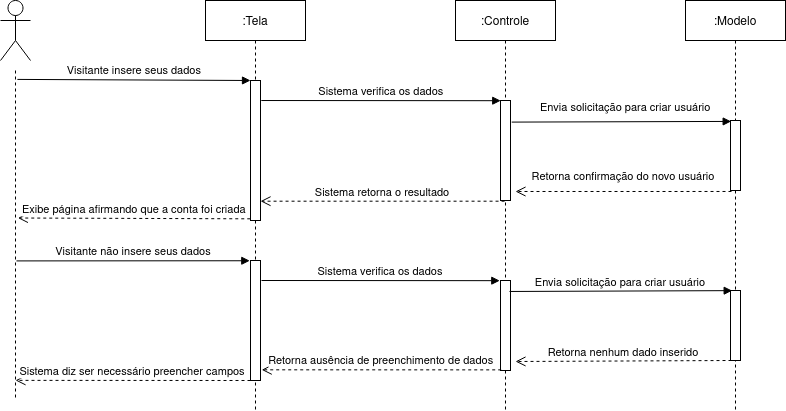
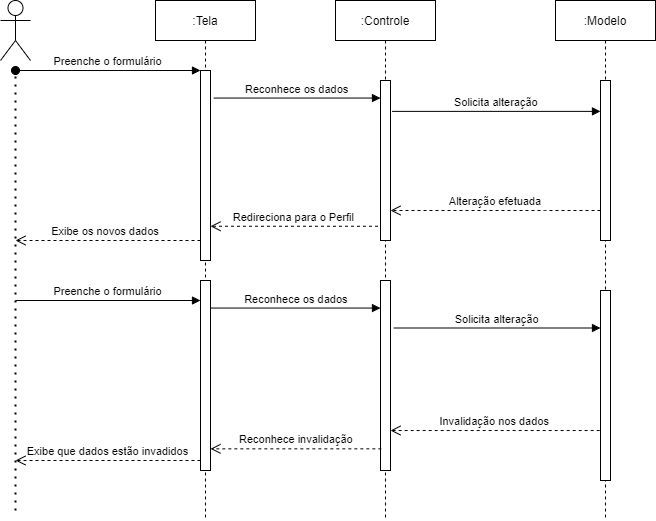
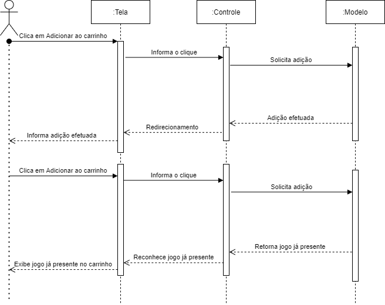

# Documento de Casos de Uso

## Lista dos Casos de Uso

 - [CDU 01](#CDU-01): Efetuar login
 - [CDU 02](#CDU-02): Efetuar logout

 - [CDU 03](#CDU-03): Pesquisar por Jogos 
 - [CDU 04](#CDU-04): Criar uma conta como jogador

 - [CDU 05](#CDU-05): Modificar seus dados de jogador 
 - [CDU 06](#CDU-06): Adicionar jogo no carrinho 
 - [CDU 07](#CDU-07): Comprar jogo
 - [CDU 08](#CDU-08): Excluir jogo do carrinho
 - [CDU 09](#CDU-09): Visualizar carrinho

 - [CDU 10](#CDU-10): Consultar registros de jogadores
 - [CDU 11](#CDU-11): Consultar registros de jogos
 - [CDU 12](#CDU-12): Consultar registros de carrinhos de jogadores
 - [CDU 13](#CDU-13): Consultar registros de administradores

 - [CDU 14](#CDU-14): Adicionar jogadores
 - [CDU 15](#CDU-15): Adicionar jogos
 - [CDU 16](#CDU-16): Adicionar administradores

 - [CDU 17](#CDU-17): Alterar jogadores
 - [CDU 18](#CDU-18): Alterar jogos
 - [CDU 19](#CDU-19): Alterar administradores 

 - [CDU 20](#CDU-20): Excluir jogadores
 - [CDU 21](#CDU-21): Excluir jogos
 - [CDU 22](#CDU-22): Excluir administradores 

## Lista dos Atores

 - Jogador
 - Administrador
 - Visitante

## Diagrama de Casos de Uso

## Descrição dos Casos de Uso

### CDU 01

Efetuar login

**Fluxo Principal**

1. O sistema apresentará um formulário com os campos email e senha.
2. O Visitante deve inserir seus dados de login no formulário e clicar no botão “logar”.
3. O sistema verificará se os dados correspondem a algum Jogador/Adminstrador.
4. Caso o sistema confirmar o login como Jogador, o sistema direciona para o painel do Jogador, caso o sistema confirmar o login como Administrador, o sistema direciona para o painel do Administrador.

**Fluxo Alternativo A**

1. O sistema apresentará um formulário com os campos email e senha.
2. O Visitante não insere seus dados de login no formulário e clicar no botão “logar”.
3. O sistema avisa que todos so campos precisam ser preenchidos.

### CDU 02

Efetuar logout

**Fluxo Principal**

1. O sistema apresentar um botão chamado “deslogar”.
2. O Jogador/Adminstrador clica no botão “deslogar”.
3. O sistema irá “deslogar” o Jogador/Adminstrador e direciona para o página de login.

### CDU 03

Pesquisar por Jogos

**Fluxo Principal**

1. O sistema apresentará uma página que permita o Visitante/Jogador escrever do nome do jogo que deseja.
2. O Visitante/Jogador deve escrever o nome do jogo no campo de procura e aperta o botão “procurar” ou aperta a tecla ENTER.
3. O sistema procurará por um registro de jogos que possua o nome digitado.
4. O sistema mostrará os resultados do(s) jogo(s) encontrados.

**Fluxo Alternativo A**

1. O sistema apresentará uma página que permita o Visitante/Jogador escrever do nome do jogo que deseja.
2. O Visitante/Jogador deve escrever o nome do jogo no campo de procura e aperta o botão “procurar” ou aperta a tecla ENTER.
3. O sistema verifica que não há nenhum jogo que possua o nome digitado.
4. O sistema mostrará que não há nenhum jogo com o nome digitado.

### CDU 04

Criar uma conta como jogador

**Fluxo Principal**

1. O sistema apresentar um formulário com os campos nome, nickmane, email e senha.
2. O visitante deve preencher o formulário com seus dados e clicar no botão “Criar conta”.
3. O sistema verifica os dados e criará uma conta de Jogador.
4. O sistema mostra uma página afirmando que a conta foi criada com sucesso.

**Fluxo Alternativo A**

1. O sistema apresentar um formulário com os campos nome, nickmane, email e senha.
2. O visitante não preenche o formulário com seus dados e clicar no botão “Criar conta”.
3. O sistema avisa que todos so campos precisam ser preenchidos.

### CDU 05

Modificar seus dados de jogador 

**Fluxo Principal**

1. O sistema mostrará uma página com os atuais dados dos Jogador e um formulário com os campos nickname, email e senha para a inserção dos novos dados e um botão “Alterar”.
2. O Jogador escreve os seus novos dados e clicar no botão “Alterar”.
3. O sistema realiza as alterações na conta do Jogador.

**Fluxo Alternativo A**

1. O sistema mostrará uma página com os atuais dados dos Jogador e um formulário com os campos nickname, email e senha para a inserção dos novos dados e um botão “Alterar”.
2. O Jogador escreve os seus novos dados e clicar no botão “Alterar”.
3. O sistema verifica que o email já está em uso.
4. A página informa que o email já esta sendo usado.

### CDU 06

Adicionar jogo no carrinho 

**Fluxo Principal**

1. Na página do Jogo que deseja adicionar ao carrinho, o sistema apresenta os dados do jogo. 
2. O Jogador clicará no botão “Adicionar ao carrinho”.
3. O sistema adiciona o jogo ao carrinho.
4. O sistema mostrará uma página que afirma que o jogo foi adicionado com sucesso ao carrinho

**Fluxo Alternativo A**

1. Na página do Jogo que deseja adicionar ao carrinho, o sistema apresenta os dados do jogo. 
2. O sistema verifica que o jogo já está no carrinho.
3. A página informa que o jogo já está no carrinho.

### CDU 07

Comprar jogo

**Fluxo Principal**

1. O sistema, no painel da conta do Jogador, apresentará o atual carrinho com os jogos que estão no carrinho.
2. O Jogador deve clicar em “Finalizar compra”.
3. O sistema registrará a compra do carrinho do cliente.
4. O sistema mostrará uma página que afirma que a compra foi realizada com sucesso.

### CDU 08

Excluir jogo do carrinho

**Fluxo Principal**

1. O sistema, no painel da conta do Jogador, apresentará o atual carrinho com os jogos que estão no carrinho.
2. O Jogador clica no botão "Remover" no campo do Jogo que deseja excluir no carrinho.
3. O sistema tira o Jogo do carrinho.

**Fluxo Alternativo A**

1. O sistema, no painel da conta do Jogador, apresentará o atual carrinho com os jogos que estão no carrinho.
2. O sistema verifica que não há nenhum jogo no carrinho
3. o sistea informa "Você ainda não possui nenhum jogo no carrinho".

### CDU 09

Visualizar carrinho

**Fluxo Principal**

1. O jogador entra na pagina do seu painel.
2. O sistema, no painel da conta do Jogador, apresentará o atual carrinho com os jogos que estão no carrinho.

**Fluxo Alternativo A**

1. O jogador entra na pagina do seu painel.
2. O sistema, no painel da conta do Jogador, informa que o Jogador ainda não possui nenhum jogo no carrinho.

### CDU 10

Consultar registros de jogadores

**Fluxo Principal**

1. O sistema, no Topíco “Jogadores” da Página Inicial da seção do Administrador, apresenta um botão “Consultar por nome”.
2. O Administrador deverá clicar no botão “Consultar por nome”.
3. O sistema mostrará uma página com um campo para escrever o nome do Jogador que procura-se e um botão ”procurar”.
4. O Administrador deverá escrever o nome do Jogador que deseja e clicar no botão “procurar”.
5. O sistema procurará por um registro de Jogador que possua o nome descrito.
6. O sistema mostrará os resultados do(s) Jogador(es) encontrados.

**Fluxo Alternativo A**

1. O sistema, no Topíco “Jogadores” da Página Inicial da seção do Administrador, apresenta um botão “Consultar por nome”.
2. O Administrador deverá clicar no botão “Consultar por nome”.
3. O sistema mostrará uma página com um campo para escrever o nome do Jogador que procura-se e um botão ”procurar”.
4. O Administrador não escreve o nome do Jogador que deseja e clicar no botão “procurar”.
6. O sistema mostrará os todos os jogadores.

### CDU 11

Consultar registros de jogos

**Fluxo Principal**

1. O sistema, no Topíco “Jogos” da Página Inicial da seção do Administrador, apresenta um botão “Consultar por nome”.
2. O Administrador deverá clicar no botão “Consultar por nome”.
3. O sistema mostrará uma página com um campo para escrever o nome do Jogo que procura-se e um botão ”procurar”.
4. O Administrador deverá escrever o nome do Jogo que deseja e clicar no botão “procurar”.
5. O sistema procurará por um registro de Jogos que possua o nome descrito.
6. O sistema mostrará os resultados do(s) Jogos(s) encontrados.

**Fluxo Alternativo A**

1. O sistema, no Topíco “Jogos” da Página Inicial da seção do Administrador, apresenta um botão “Consultar por nome”.
2. O Administrador deverá clicar no botão “Consultar por nome”.
3. O sistema mostrará uma página com um campo para escrever o nome do Jogo que procura-se e um botão ”procurar”.
4. O Administrador não escreve o nome do Jogo que deseja e clicar no botão “procurar”.
6. O sistema mostrará todos os jogos.

### CDU 12

Consultar registros de carrinhos de Jogadores

**Fluxo Principal**

1. O sistema, na página dos resultados da busca por Jogadores da seção do Administrador, apresentará uma listagem em tabela do(s) Jogadores(s) buscado. Cada linha da tabela apresentará os dados do Jogador e os botões “Alterar”, ”Excluir” e “Carrinhos”.
2. O Administrador deverá clicar no botão “Carrinhos”.
3. O sistema mostrará uma listagem de todos os carinho do Jogador.

**Fluxo Alternativo A**

1. O sistema, na página dos resultados da busca por Jogadores da seção do Administrador, apresentará uma listagem em tabela do(s) Jogadores(s) buscado. Cada linha da tabela apresentará os dados do Jogador e os botões “Alterar”, ”Excluir” e “Carrinhos”.
2. O Administrador deverá clicar no botão “Carrinhos”.
3. O sistema mostrará que o Jogador ainda não comprou nenhum carrinho.

### CDU 13

Consultar registros de administradores

**Fluxo Principal**

1. O sistema, no Topíco “Administradores” da Página Inicial da seção do Administrador, apresenta um botão “Consultar por nome”.
2. O Administrador deverá clicar no botão “Consultar por nome”.
3. O sistema mostrará uma página com um campo para escrever o nome do Administradores que procura-se e um botão ”procurar”.
4. O Administrador deverá escrever o nome do Administradores que deseja e clicar no botão “procurar”.
5. O sistema procurará por um registro de Administradores que possua o nome descrito.
6. O sistema mostrará os resultados do(s) Administrador(es) encontrados.

**Fluxo Alternativo A**

1. O sistema, no Topíco “Administradores” da Página Inicial da seção do Administrador, apresenta um botão “Consultar por nome”.
2. O Administrador deverá clicar no botão “Consultar por nome”.
3. O sistema mostrará uma página com um campo para escrever o nome do Administradores que procura-se e um botão ”procurar”.
4. O Administrador não escreve o nome do Administradores que deseja e clicar no botão “procurar”.
6. O sistema mostrará todos os adminstradores.

### CDU 14

Adicionar jogadores

**Fluxo Principal**

1. O sistema, no Topíco “Jogador” da Página Inicial da seção do Administrador, apresenta um botão “Cadastrar”.
2. O Administrador deverá clicar no botão “Cadastrar”.
3. O sistema mostrará uma página com um formulário com os campos nome, nickname, email e senha para a inserção dos dados e um botão “Adicionar”.
4. O Administrador deverá escrever os dados do Jogador e clicar no botão “Adicionar”
5. O sistema realizará o armazenamento do Jogador.

**Fluxo Alternativo A**

1. O sistema, no Topíco “Jogador” da Página Inicial da seção do Administrador, apresenta um botão “Cadastrar”.
2. O Administrador deverá clicar no botão “Cadastrar”.
3. O sistema mostrará uma página com um formulário com os campos nome, nickname, email e senha para a inserção dos dados e um botão “Adicionar”.
4. O Administrador não preenche todos os campos do formulario com os dados do Jogador e clicar no botão “Adicionar”
5. O sistema informa que todos os campos devem ser preenchidos.

### CDU 15

Adicionar jogos

**Fluxo Principal**

1. O sistema, no Topíco “Jogos” da Página Inicial da seção do Administrador, apresenta um botão “Cadastrar”.
2. O Administrador deverá clicar no botão “Cadastrar”.
3. O sistema mostrará uma página com um formulário com os campos nome, descrição, requisitos, sistema operacional, data de lançamento para a inserção dos dados e um botão “Adicionar”.
4. O Administrador deverá escrever os dados do Jogo e clicar no botão “Adicionar”
5. O sistema realizará o armazenamento do Jogo.

**Fluxo Alternativo A**

1. O sistema, no Topíco “Jogos” da Página Inicial da seção do Administrador, apresenta um botão “Cadastrar”.
2. O Administrador deverá clicar no botão “Cadastrar”.
3. O sistema mostrará uma página com um formulário com os campos nome, descrição, requisitos, sistema operacional, data de lançamento para a inserção dos dados e um botão “Adicionar”.
4. O Administrador não preenche todos os campos do formulario com do Jogo e clicar no botão “Adicionar”
5. O sistema informa que todos os campos devem ser preenchidos.

### CDU 16

Adicionar administradores

**Fluxo Principal**

1. O sistema, no Topíco “Administradores” da Página Inicial da seção do Administrador, apresenta um botão “Cadastrar”.
2. O Administrador deverá clicar no botão “Cadastrar”.
3. O sistema mostrará uma página com um formulário com os campos nome, email, uma senha para a inserção dos dados e um botão “Adicionar”.
4. O Administrador deverá escrever os dados do administrador e clicar no botão “Adicionar”
5. O sistema realizará o armazenamento do administrador.

**Fluxo Alternativo A**

1. O sistema, no Topíco “Administradores” da Página Inicial da seção do Administrador, apresenta um botão “Cadastrar”.
2. O Administrador deverá clicar no botão “Cadastrar”.
3. O sistema mostrará uma página com um formulário com os campos nome, email, uma senha para a inserção dos dados e um botão “Adicionar”.
4. O Administrador não preenche todos os campos do formulario com os dados do administrador e clicar no botão “Adicionar”
5. O sistema informa que todos os campos devem ser preenchidos.

### CDU 17

Alterar jogadores

**Fluxo Principal**

1. O sistema, na página dos resultados da busca por Jogador da seção do administrador, apresentará uma listagem em tabela do(s) Jogador(es) buscado. Cada linha da tabela apresentará os dados do cliente e os botões “Alterar”, ”Excluir” e “Carrinhos”
2. O administrador deverá clicar no botão “Alterar”
3. O sistema mostrará uma página com os atuais dados do Jogador e um formulário com os campos nome, nickname, email e senha para a inserção dos novos dados e um botão “Alterar”
4. O administrador deverá escrever os novos dados do Jogador e clicar no botão “Alterar”
5. O sistema realizará as alterações no registro

**Fluxo Alternativo A**

1. O sistema, na página dos resultados da busca por Jogador da seção do administrador, apresentará uma listagem em tabela do(s) Jogador(es) buscado. Cada linha da tabela apresentará os dados do cliente e os botões “Alterar”, ”Excluir” e “Carrinhos”
2. O administrador deverá clicar no botão “Alterar”
3. O sistema mostrará uma página com os atuais dados do Jogador e um formulário com os campos nome, nickname, email e senha para a inserção dos novos dados e um botão “Alterar”
4. O administrador não preenche todos os novos dados do Jogador e clicar no botão “Alterar”
5. O sistema retorna ao formulario.

### CDU 18

Alterar jogos

**Fluxo Principal**

1. O sistema, na página dos resultados da busca por Jogo da seção do administrador, apresentará uma listagem em tabela do(s) Jogo(s) buscado. Cada linha da tabela apresentará os dados do cliente e os botões “Alterar”, ”Excluir” e “Carrinhos”
2. O administrador deverá clicar no botão “Alterar”
3. O sistema mostrará uma página com os atuais dados do Jogador e um formulário com os campos nome, nickname, email e senha para a inserção dos novos dados e um botão “Alterar”
4. O administrador deverá escrever os novos dados do Jogo e clicar no botão “Alterar”
5. O sistema realizará as alterações no registro

**Fluxo Alternativo A**

1. O sistema, na página dos resultados da busca por Jogo da seção do administrador, apresentará uma listagem em tabela do(s) Jogo(s) buscado. Cada linha da tabela apresentará os dados do cliente e os botões “Alterar”, ”Excluir” e “Carrinhos”
2. O administrador deverá clicar no botão “Alterar”
3. O sistema mostrará uma página com os atuais dados do Jogador e um formulário com os campos nome, nickname, email e senha para a inserção dos novos dados e um botão “Alterar”
4. O administrador não preenche todos os novos dados do Jogo e clicar no botão “Alterar”
5. O sistema retorna ao formulario.

### CDU 19

Alterar administradores

**Fluxo Principal**

1. O sistema, na página dos resultados da busca por administrador da seção do administrador, apresentará uma listagem em tabela do(s) administrador(es) buscado. Cada linha da tabela apresentará os dados do cliente e os botões “Alterar”, ”Excluir” e “Carrinhos”
2. O administrador deverá clicar no botão “Alterar”
3. O sistema mostrará uma página com os atuais dados do administrador e um formulário com os campos nome, email, uma senha para a inserção dos novos dados e um botão “Alterar”
4. O administrador deverá escrever os novos dados do administrador e clicar no botão “Alterar”
5. O sistema realizará as alterações no registro

**Fluxo Alternativo A**

1. O sistema, na página dos resultados da busca por administrador da seção do administrador, apresentará uma listagem em tabela do(s) administrador(es) buscado. Cada linha da tabela apresentará os dados do cliente e os botões “Alterar”, ”Excluir” e “Carrinhos”
2. O administrador deverá clicar no botão “Alterar”
3. O sistema mostrará uma página com os atuais dados do administrador e um formulário com os campos nome, email, uma senha para a inserção dos novos dados e um botão “Alterar”
4. O administrador não preenche todos os novos dados do administrador e clicar no botão “Alterar”
7. O sistema retorna ao formulario.

### CDU 20

Excluir jogadores

**Fluxo Principal**

1. O sistema, na página dos resultados da busca por jogadores da seção do administrador, apresentará uma listagem em tabela do(s) cliente(s) buscado. Cada linha da tabela apresentará os dados do Jogador e os botões “Alterar”, ”Excluir” e “Carrinhos”
2. O administrador deverá clicar no botão “Excluir”
3. O sistema mostrará uma página perguntando se o administrador deseja realmente excluir o jogador e os botões "Cancelar" e ”Excluir”
4. O administrador deverá clicar em ”Excluir”

**Fluxo Alternativo A**

1. O sistema, na página dos resultados da busca por jogadores da seção do administrador, apresentará uma listagem em tabela do(s) cliente(s) buscado. Cada linha da tabela apresentará os dados do Jogador e os botões “Alterar”, ”Excluir” e “Carrinhos”
2. O administrador deverá clicar no botão “Excluir”
3. O sistema mostrará uma página perguntando se o administrador deseja realmente excluir o jogador e os botões "Cancelar" e ”Excluir”
6. O administrador deve clicar em no botão “Cancelar”
7. O sistema retorna a página dos resultados da busca.

### CDU 21

Excluir jogos

**Fluxo Principal**

1. O sistema, na página dos resultados da busca por jogos da seção do administrador, apresentará uma listagem em tabela do(s) cliente(s) buscado. Cada linha da tabela apresentará os dados do jogo e os botões “Alterar”, ”Excluir” e “Carrinhos”
2. O administrador deverá clicar no botão “Excluir”
3. O sistema mostrará uma página perguntando se o administrador deseja realmente excluir o jogo e os botões "Cancelar" e ”Excluir”
4. O administrador deverá clicar em ”Excluir”

**Fluxo Alternativo A**

1. O sistema, na página dos resultados da busca por jogos da seção do administrador, apresentará uma listagem em tabela do(s) cliente(s) buscado. Cada linha da tabela apresentará os dados do jogo e os botões “Alterar”, ”Excluir” e “Carrinhos”
2. O administrador deverá clicar no botão “Excluir”
3. O sistema mostrará uma página perguntando se o administrador deseja realmente excluir o jogo e os botões "Cancelar" e ”Excluir”
6. O administrador deve clicar em no botão “Cancelar”
7. O sistema retorna a página dos resultados da busca.

### CDU 22

Excluir administradores 

**Fluxo Principal**

1. O sistema, na página dos resultados da busca por administradores da seção do administrador, apresentará uma listagem em tabela do(s) administradores(es) buscado. Cada linha da tabela apresentará os dados do administradores e os botões “Alterar”, ”Excluir” e “Carrinhos”
2. O administrador deverá clicar no botão “Excluir”
3. O sistema mostrará uma página perguntando se o administrador deseja realmente excluir o administradores e os botões "Cancelar" e ”Excluir”
4. O administrador deverá clicar em ”Excluir”

**Fluxo Alternativo A**

1. O sistema, na página dos resultados da busca por administradores da seção do administrador, apresentará uma listagem em tabela do(s) administradores(es) buscado. Cada linha da tabela apresentará os dados do administradores e os botões “Alterar”, ”Excluir” e “Carrinhos”
2. O administrador deverá clicar no botão “Excluir”
3. O sistema mostrará uma página perguntando se o administrador deseja realmente excluir o administradores e os botões "Cancelar" e ”Excluir”
6. O administrador deve clicar em no botão “Cancelar”
7. O sistema retorna a página dos resultados da busca.
