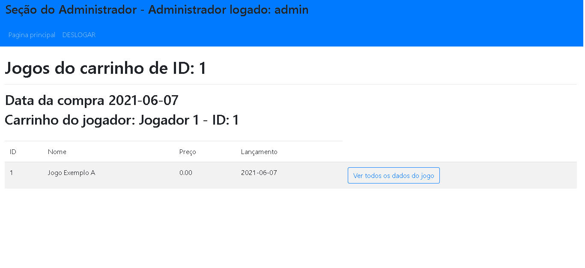

# Manual do Usuário

**Lista das Funcionalidades:**
 - [Introdução](#Introdução)
 - [Página inicial da Seção do Jogador](#Página-inicial-da-Seção-do-Jogador)
 - [Procurar por jogos](#Procurar-por-jogos)
 - [Realizar Login](#Realizar-Login)
 - [Criar uma conta como jogador](#Criar-uma-conta-como-jogador)
 - [Adicionar um jogo ao carrinho](#Adicionar-um-jogo-ao-carrinho)
 - [Página Perfil do Jogador, Remover jogo do carrinho e Finalizar compra](#Página-Perfil-do-Jogador,-Remover-jogo-do-carrinho-e-Finalizar-compra)
 - [Alterar seus dados de Jogador](#Alterar-seus-dados-de-Jogador)
 - [Página principal da Seção do administrador](#Página-principal-da-Seção-do-administrador)
 - [Funcionalidades de Administração de Administrador](#Funcionalidades-de-Administração-de-Administrador)
 - [Funcionalidades de Administração de Jogadores](#Funcionalidades-de-Administração-de-Jogadores)
 - [Funcionalidades de Administração de Jogos](#Funcionalidades-de-Administração-de-Jogos)
 - [Listagem de todos os registros de compras - Carrinhos](#Listagem-de-todos-os-registros-de-compras---Carrinhos)
 - [Listagem de todos os registros de compras de jogos](#Listagem-de-todos-os-registros-de-compras-de-jogos)

## Introdução
O Site possui 3 usuários:
* Jogador(Cliente)
* Usuário não logado
* Administrador

O site possui 2 seções:
* Seção do Jogador
* Seção do Administrador

A Seção do Jogador é somente acessado pelo Jogador e o Usuário não logado, porém algumas páginas só podem ser acessados pelo Jogador.

Seção do Administrador é somente acessado pelo Administrador.

Ao entrar no site, você é levado para a Página inicial da Seção do Jogador como um Usuário não logado. A parti dessa página é possível ir para a Página de Login e realizar o login. Caso faça login como Jogador, você continuará na Seção do jogador. Caso faça login como Administrador, você será levado para a Seção do Administrador.

As funcioalidades de administração do site são realizadas na Seção do Administrador

As funcioalidades de Cliente do site são realizadas na Seção do Jogador, porém algumas funcioalidades somente podem ser realizadas quando se está logaodo como Jogador.

## Página inicial da Seção do Jogador
O usuário não logado e o logado como Jogador poderá acessar a página principal do site, visualizar e buscar
por jogos, realizar o login ou criar uma conta para si como jogador

A página principal tem informações rápidas instruções sobre como funciona o site.

O menu de navegação da seção do jogador apresenta as funcionalidades: Botão de ir
para a página principal, botão para ir a página de visualização dos jogos, barra de
pesquisa de jogos e botão de login.

Na barra de pesquisa, o usuário pode escrever o nome do jogo que
deseja e apertar a tecla ENTER ou a imagem de lupa da barra. O usuário será direcionado
para a página de busca por jogo já filtrado por jogo com o nome parecido com o
digitado pelo usuário.

O botão login se altera: se o jogador não estiver logado, o botão levará o
usuário para a página de login, se o usuário estiver logado como jogador, o botão levará para
a seção do jogador.

O menu de navegação é altamente responsivo, se adaptando a qualquer tamanho
de tela e mantendo as funcionalidades.

## Procurar por jogos

A página de procurar por jogos na seção do jogador apresenta uma barra de
pesquisa onde se pode escrever o nome do jogo que se busca.

Na listagem dos resultados da busca, aparecerá os produtos com suas
informações. Para visualizar o jogo apenas deve-se clicar na linha do jogo que
deseja.

Observação: Para visualizar todos os jogos, deve-se deixar o campo da barra de
pesquisa vazio e clicar no botão buscar.

A página do jogo apresenta todas as informações sobre um jogo, como nome,
imagem, preço, descrição e data de lançamento.

## Realizar Login

Na página de login, o jogador não logado, caso possua uma conta tanto de jogador
ou de adminsitrador, poderá colocar seu email e sua senha e realizar o login.
Caso o seja inserido as informações de login de um funcionários, o site fará o login
como administrador e direciona para a seção do administrador. Caso seja inserido as
informações de login de um jogador, o site fará o login como jogador, permanecerá na mesma
seção do site mas direciona para o seção do jogador. Caso as informações inseridas não
estejam registradas, o site mostrará que o email ou a senha são inválidos.
Se um usuario não logado que não possui uma conta deseja virar um jogador, ele
poderá clicar em “Criar uma conta aqui” para ser direcionado para a página de criação de
conta de jogador.

## Criar uma conta como jogador

A página criar conta permite um usuário não logado criar uma conta de jogador para
si. A página requisita os dados nome, email e senha. Caso já exista um jogador com o nome
ou email inserido, o formulário informará que já existe um cliente com o nome ou email
inserido.
Ao clicar em cadastrar e os dados forem válidos, uma conta será criada para o
jogador, mas não será logado automaticamente. O usuário continuará não logado e deverá
voltar a página de login e logar na sua nova conta criada.

Ao ser logado como jogador, o jogador terá acesso a toda seção jogador. As páginas
da seção jogador do site são todas as páginas disponíveis a um usuário não logado mais o
sessão do jogador.

## Adicionar um jogo ao carrinho

Quando um cliente entra na página de um jogo, além das informações já
disponíveis a usuários não logados, terá a opção de escolher um jogo e
adicionar ao um carrinho. Se o cliente já tiver um carrinho com outros
jogos, esse jogo será adicionado junto aos já existentes no carrinho, se não possuir
um carrinho, um novo carrinho será criado e o produto será adicionado.

Caso o jogador não esteja logado, não será possível colocar o jogo em um
carrinho e mostrará um aviso.
Caso o jogador já possua o jogo, não será possível colocar o jogo em um
carrinho e mostrará um aviso.
Caso o jogo já esteja no carrinho do jogador, não será possível colocar o jogo em um
carrinho e mostrará um aviso.

## Página Perfil do Jogador, Remover jogo do carrinho e Finalizar compra

A sessão do jogador, apresenta informações e funcionalidades sobre o jogador, o
carrinho atual, e todas as compras já realizadas pelo jogador.

No início da página é apresentado o nome e o email do jogador e os botões “Editar
dados” e “sair”. O botão “Editar dados” leva o jogador a uma página para alterar seus
dados. O botão “Sair” realiza logout do jogador.

Logo em seguida é apresentado os Jogos que o Jogador já possui, o atual carrinho do jogador com os jogos que estão
no carrinho e o botão "Remover", o preço total do carrinho e o botão “finalizar compra”. 

O botão “finalizar compra” realiza a “efetuação da compra” e registra a compra do jogador na base de dados do site.

O botão "Remover" correspondente a um jogo irá remover o jogo do carrinho

## Alterar seus dados de Jogador

Ao jogador clicar no botão “Editar dados”, ele será direcionado a uma página onde
poderá colocar seus novos dados.
A página não requer obrigatoriamente que o usuário altere sua senha, porém se ele
quiser, deverá clicar o check alterar senha.

## Página principal da Seção do administrador

Ao ser logado como administrador, o administrador terá acesso a toda seção administrador.
As páginas da seção adminiastrador do site permitem o gerenciamento das da base de dados
do site, como listar, consultar, cadastrar, alterar e excluir registros de jogadores, jogos,
carrinhos de jogos e outros administradores.

O login de funcionário que vem por padrão é:
EMAIL: admin@admin
SENHA: admin

Assim que o administrador faz seu login, ele é enviado para o painel do administrador. O
painel do administrador apresenta o Menu de navegação da seção do administrador, e 5 tópicos para o adminstradores, jogadores e jogos. São estes: Cadastrar, listar, consultar, alterar e excluir" 

## Funcionalidades de Administração de Administrador

### Cadastrar

Na página Adicionar Administrador, o Administrador pode cadastrar um Administrador. Ele deve
incluir obrigatoriamente os dados nome, email e senha. Caso o nome ou email inserido já
estejam registrados na base de dados, o formulário informará que já existe um Administrador ou Jogador com o
nome ou email inserido.

### Listar

A página Listar Administrador exibe uma tabela com as colunas “ID”, “Nome” e “Email”, em
que as linhas são os registros de Administrador.

### Consultar por nome

A página consultar Administrador apresenta uma campo para inserir o nome do Administrador que
deseja e o botão “procurar”. Ao inserir o nome e clicar em procurar ou apertar ENTER, a
página mostrará uma tabela com todos os Administrador que possuem nome parecido com o
inserido. Cada linha da tabela representa um registro de jogo e tem os dados “ID”,
“Nome”, "email", “Alterar” e “Excluir”.
Os botões “Alterar” e “Excluir” levam as páginas Alterar dados do Administrador e Excluir
Administrador, respectivamente do Administrador apresentado na linha.
Observação: Para visualizar todos os Administrador, deve-se deixar o campo de inserir o
nome vazio e clicar no botão “procurar”.

### Alterar

Na página inicial da seção do Administrador, botão "Alterar(por ID)" de Administrador leva para uma página para inserir o ID do Administrador que deseja-se alterar.

A página Alterar dados do jogador apresenta os atuais dados do jogador e um
formulário para os novos dados.A página não requer obrigatoriamente a alteração da senha. Caso queira-se alterar, deve preencher o campo senha. Caso não queira, somente deixar o campo vazio. E por fim clicar
em “Alterar”.

### Excluir

Na página inicial da seção do Administrador, botão "Excluir(por ID)" de Administrador leva para uma página para inserir o ID do Administrador que deseja-se excluir.

A página Excluir jogador apresenta os atuais dados do jogador e pergunta se o se há
certeza sobre excluir o registro. Se há certeza deve-se clicar em “EXCLUIR”, se não
deve-se clicar em “Cancelar”.

## Funcionalidades de Administração de Jogadores

### Cadastrar

Na página Cadastrar jogador, o administrador pode cadastrar um novo
jogador. Ele deve incluir obrigatoriamente os dados nome, nickname, email e senha. Caso o email inserido já estejam registrados na base de dados, o formulário informará que já
existe um administrador ou jogador com email inserido.

### Listar

A página Listar Jogador exibe uma tabela com as colunas “ID”, “Nome”, "Nickname" e “Email”,
em que as linhas são os registros de Jogadores.

### Consultar por nome

A página Consultar Jogadores por nome exibe uma barra de pesquisa onde se pode procurar por um jogador especifico pelo seu nome, e é possível excluir e alterar os o jogadores e visualizar todos os carrinhos que o jogador já teve. E caso a barra de pesquisa seja deixada em branco todos os jogadores são exibidos.

### Alterar

Na página inicial da seção do Administrador, botão "Alterar(por ID)" de jogadores leva para uma página para inserir o ID do jogador que deseja-se alterar.

A página Alterar dados de jogador apresenta os atuais dados do jogador e
um formulário para os novos dados. A página não requer obrigatoriamente a alteração da senha. Caso queira-se alterar, deve preencher o campo senha. Caso não queira, somente deixar o campo vazio. E por fim clicar
em “Alterar”.

### Excluir

Na página inicial da seção do Administrador, botão "Excluir(por ID)" de jogadores leva para uma página para inserir o ID do jogador que deseja-se excluir.

A página Excluir administrador é feita por id, apresenta os atuais dados do administrador e pergunta se
o administrador tem certeza sobre excluir o registro. Se há certeza deve-se clicar em “EXCLUIR”, se não
deve-se clicar em “Cancelar”. 

## Funcionalidades de Administração de Jogos

### Cadastrar

Na página cadastrar jogos, o administrador pode cadastrar ume jogo. Ele
deve incluir obrigatoriamente os dados nome, preço, data de lançamento ,descrição, Requistos de hardware do Dispositivo, Sistemas operacionais disponiveis para o jogo e Arquivo de imagem no formato .png. Caso o nome inserido já esteja registrado na base de dados, o
formulário informará que já existe um jogo com o nome inserido.

### Listar

A página Listar jogo exibe uma tabela com as colunas “ID”, “Nome”, “Preço” e
"lançamemto" em que as linhas são os registros de jogos. Cada linha também apresenta o
Botão “Mais info” que leva para a página de mais informações sobre o jogo. Essa página
será explicada no próximo tópico.

A página "Dados do Jogo" exibe todas as informações dos jogos.

### Consultar por nome

A página consultar jogo apresenta uma campo para inserir o nome do jogo que
deseja e o botão “procurar”. Ao inserir o nome e clicar em procurar ou apertar ENTER, a
página mostrará uma tabela com todos os jogos que possuem nome parecido com o
inserido. Cada linha da tabela representa um registro de produto e tem os dados “ID”,
“Nome”, “Preço”, "lançamento", “Alterar” e “Excluir”.
Os botões “Alterar” e “Excluir” levam as páginas Alterar dados do jogo e Excluir
jogos, respectivamente do jogo apresentado na linha.
Observação: Para visualizar todos os jogos, deve-se deixar o campo de inserir o
nome vazio e clicar no botão “procurar”.
O botão "Registro de compras do jogo" será abordado mais a frente.

### Alterar

A página Alterar dados do jogo apresenta os atuais dados do jogo e um
formulário para os novos dados. A página não requer obrigatoriamente que seja alterada a
imagem do jogo, porém se quiser alterá-la, precisa somente incluir o novo arquivo de
imagem no formulário, e por fim clicar em “Alterar”.

### Excluir

A página Excluir jogo apresenta os atuais dados do administrador e pergunta se o
se há certeza sobre excluir o registro. Se há certeza deve-se clicar em “EXCLUIR”, se não,
deve-se clicar em “Cancelar”.

## Listagem de todos os registros de compras - Carrinhos

### ESCLARECIMENTO:

Por convensão do sistema, os registros de compras já realizadas(finalizadas) pelos jogadores são chamadas de REGISTRO DE CARRINHOS na base de dados.

Ou seja, quando um jogador coloca jogos no carrinho e finaliza a compra desses jogos do carrinho, isso fica registrado na base de dados como um registro de carrinho.

Então, quando ler-se "Carrinho" no sistema, o sistema está se referindo a um registro de compra finalizada. 

Logo, todo carrinho tem: 
* ID (Identificação do carrinho)
* Comprador (o Jogador que finalizou a compra dos jogos do carrinho)
* Jogos

ATENÇÃO: carrinhos ainda em aberto em que a compra dele ainda não foi finalizada NÃO ficam armazenados na base de dados.

### Listagem de todos os carrinhos

Na página inicial da seção do Adminsitrador, na parte de carrinhos há o botão "Listar todos carrinho" que levará a uma página que faz a listagem de todos com carrinhos até então finalizados.

Nessa página, há uma tabela em que cada linha é um registro de carrinho com o dados do carrinho: "ID do carrinho", "Data da compra", "ID do Jogador comprador" e "Nome do Jogador comprador". E o botão "Jogos do carrinho" levá a uma página para vsualizar todos os jogos que foram comprados no carrinho da tal linha.

## Listagem de todos os carrinhos de um Jogador

Na página de consultar jogadores por nome, em cada linha de registro de jogador há o botão "Carrinhos do Jogador".

Esse botão leva a uma página que lista todos os carrinhos já finalizados do específico jogador selecionado.

A página faz a listagem dos carrinhos do jogador, apresentando os dados do carrinho e um botão para visualizar todos os jogos de um específico carrinho.

## Listagem de todos os registros de compras de jogos

Na página de consultar jogos por nome, em cada linha de registro de jogo há o botão "Registros de compras do jogo".

Esse botão leva a uma página que faz uma listagem de todos os carrinho que já compraram o jogo

